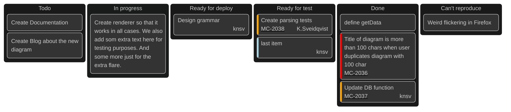

# Kanban Board

This is a kanban board created with Mermaid.

## How to View This Chart

This kanban board will render automatically when viewed on GitHub. The chart uses the neo-dark theme and includes ticket links to Atlassian.

## About Mermaid Charts in GitHub

GitHub has native support for Mermaid diagrams in markdown files. Simply place your Mermaid code within a code block with the language specified as "mermaid". 